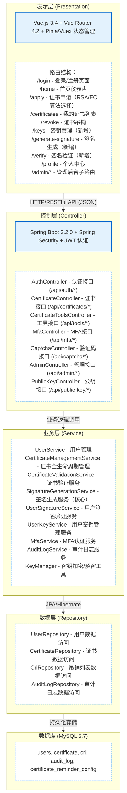

```mermaid
%%{init: {'flowchart': {'useMaxWidth': false, 'padding': 20, 'nodeSpacing': 30, 'rankSpacing': 30}}}%%
flowchart TD
    subgraph layer1 ["表示层 (Presentation)"]
        direction TB
        P_TECH["Vue.js 3.4 + Vue Router 4.2 + Pinia/Vuex 状态管理"]
        P_ROUTE["路由结构：<br/>/login - 登录/注册页面<br/>/home - 首页仪表盘<br/>/apply - 证书申请（RSA/EC算法选择）<br/>/certificates - 我的证书列表<br/>/revoke - 证书吊销<br/>/keys - 密钥管理（新增）<br/>/generate-signature - 签名生成（新增）<br/>/verify - 签名验证（新增）<br/>/profile - 个人中心<br/>/admin/* - 管理后台子路由"]
        P_TECH ~~~ P_ROUTE
    end

    subgraph layer2 ["控制层 (Controller)"]
        direction TB
        C_TECH["Spring Boot 3.2.0 + Spring Security + JWT 认证"]
        C_LIST["AuthController - 认证接口 (/api/auth/*)<br/>CertificateController - 证书接口 (/api/certificates/*)<br/>CertificateToolsController - 工具接口 (/api/tools/*)<br/>MfaController - MFA接口 (/api/mfa/*)<br/>CaptchaController - 验证码接口 (/api/captcha/*)<br/>AdminController - 管理接口 (/api/admin/*)<br/>PublicKeyController - 公钥接口 (/api/public-key/*)"]
        C_TECH ~~~ C_LIST
    end

    subgraph layer3 ["业务层 (Service)"]
        direction TB
        S_LIST["UserService - 用户管理<br/>CertificateManagementService - 证书全生命周期管理<br/>CertificateValidationService - 证书验证服务<br/>SignatureGenerationService - 签名生成服务（核心）<br/>UserSignatureService - 用户签名验证服务<br/>UserKeyService - 用户密钥管理服务<br/>MfaService - MFA认证服务<br/>AuditLogService - 审计日志服务<br/>KeyManager - 密钥加密/解密工具"]
    end

    subgraph layer4 ["数据层 (Repository)"]
        direction TB
        R_LIST["UserRepository - 用户数据访问<br/>CertificateRepository - 证书数据访问<br/>CrlRepository - 吊销列表数据访问<br/>AuditLogRepository - 审计日志数据访问"]
    end

    subgraph layer5 ["数据库 (MySQL 5.7)"]
        direction TB
        D_TABLES["users, certificate, crl, audit_log, certificate_reminder_config"]
    end

    layer1 -->|"HTTP/RESTful API (JSON)"| layer2
    layer2 -->|业务逻辑调用| layer3
    layer3 -->|JPA/Hibernate| layer4
    layer4 -->|持久化存储| layer5

    classDef techBox fill:#e3f2fd,stroke:#1976d2,stroke-width:2px;
    classDef listBox fill:#ffffff,stroke:#90caf9,stroke-width:1px,stroke-dasharray: 4 2;
    class P_TECH,C_TECH techBox;
    class P_ROUTE,C_LIST,S_LIST,R_LIST,D_TABLES listBox;
```

